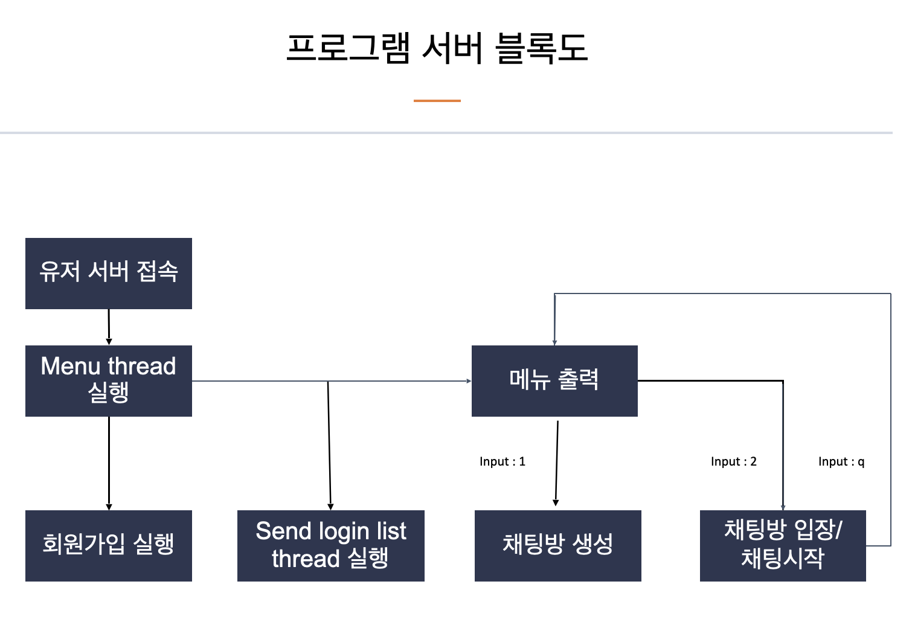

// README.txt

# 👻 need linux os 

### compile client
	$ cd client
	$ make targ1
	
### compile server
	$ cd server
	$ make targ1
	
	
	

server 실행방법 :	백그라운드로 실행시켜준다.
		
client 실행방법  : 

		1. server IP를 argv로 입력

		2. 'login' 또는 'join'  입력
		   (1) ' join' 입력시   회원가입 실행
		   (2) 'login' 입력시 로그인 id, pw입력  - 아이디를 모를경우 q를 눌러 종료.  pw를 세번이상 틀리게되면 강제 종료
		        로그인 후 실시간으로 업데이트 되는 로그인 목록을 볼 수 있습니다.

		3. 로그인 완료후 대기 화면 -> 숫자로 입력
		   (1) 방만들기 :  	방이름을 입력하라는 말이 뜨면 채팅방이름을 입력해서 방을 생성
		   (2) 채팅방 입장 :	방목록이 뜨면 방번호를 입력해서 입장
		   (3) 로그인 목록 : 로그인 목록 확인
		   (4) 채팅방 목록 : 채팅방 목록 확인

		4. 채팅방 입장후 q를 누르면 대기화면으로 나갈 수 있다. 

</img> 
